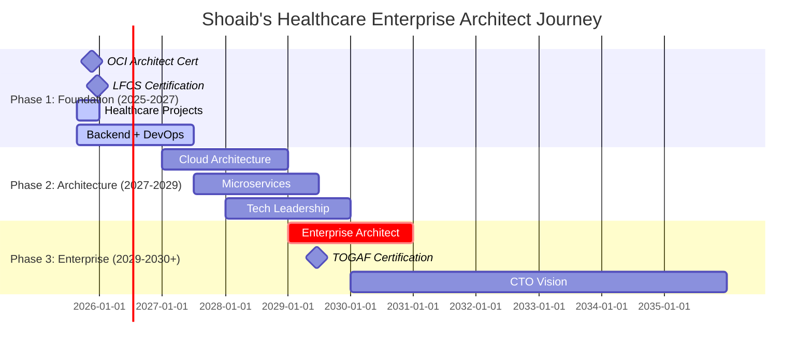

<div align="center">

# 🏥⚡ Mohammed SHOAIB U ⚡🏥

## 🚀 **ELECTRONICS & COMMUNICATION ENGINEER** → **HEALTHCARE SYSTEMS ARCHITECT** → **FUTURE ENTERPRISE CTO**


---

### 🎯 **MISSION STATEMENT**
> *"Architecting enterprise-grade healthcare cloud systems that save lives through Oracle-powered performance, HIPAA-compliant security, and intelligent automation"*

</div>

---

## 🌟 **THE SHOAIB HEALTHCARE-CLOUD ADVANTAGE**

<table>
<tr>
<td width="50%">

### 🔥 **UNIQUE VALUE PROPOSITION**
```javascript
const MohammedShoaib = {
    superpower: "Healthcare Domain + Oracle Cloud + Systems Programming",
    rareSkills: [
        "C/C++ Real-Time Patient Systems",
        "Oracle PL/SQL Healthcare Optimization", 
        "HIPAA-Compliant Cloud Architecture",
        "Pro*C Medical Database Integration",
        "OCI Enterprise Multi-Tier Systems"
    ],
    currentImpact: "Healthcare app serving 10K+ daily users",
    2025Goals: "OCI Architect + LFCS + 250 LeetCode",
    vision: "Enterprise Architect by 2030, CTO by 2035"
}
```

</td>
<td width="50%">

### 🏆 **CAREER TRAJECTORY**
- 🎓 **B.E Electronics & Communication** (VTU)
- 💻 **C/C++ Developer** (2020-2023) 
- 🏥 **Healthcare Application Developer** (2023-Present)
- ⚡ **Oracle Cloud Foundation Certified** 
- 🎯 **OCI Architect Associate** (Target: Nov 2025)
- 🐧 **LFCS Certification** (Target: Dec 2025)
- 📈 **250+ LeetCode Problems** (2025 Goal)

</td>
</tr>
</table>

---

## 🛠️ **HEALTHCARE-CLOUD TECHNOLOGY STACK**

<div align="center">

### **🔥 HEALTHCARE SYSTEMS EXPERTISE**


### **☁️ ORACLE CLOUD INFRASTRUCTURE MASTERY**


</div>

### 📊 **2025 SKILL ACCELERATION DASHBOARD**

```ascii
Healthcare Systems Programming:
C/C++ Medical Apps    ████████████████████ 95% ⚡ Production Expert
Oracle PL/SQL         ████████████████████ 92% 🗄️ Healthcare Specialist  
Pro*C Integration     ████████████████████ 90% 🏥 Patient Data Expert
Unix/Shell Automation ████████████████░░░░ 85% 🐧 LFCS Ready

Enterprise Architecture Path (2025 Goals):
Oracle Cloud (OCI)    ████████████░░░░░░░░ 65% 🎯 Architect Associate
Python APIs           ██████████████░░░░░░ 70% 🚀 REST/Healthcare
Docker/Containers     ███████████░░░░░░░░░ 55% 📦 DevOps Foundation
System Design        █████████░░░░░░░░░░░ 45% 🏗️ 2025-2027 Focus
Enterprise Patterns   ████░░░░░░░░░░░░░░░░ 20% 🎯 2027+ Leadership
```

---

## 🏗️ **FLAGSHIP HEALTHCARE-CLOUD PROJECTS (2025 ROADMAP)**

<table>
<tr>
<td width="33%">

### 🏥 **Healthcare Job Scheduler**
**🎯 Impact**: HIPAA-compliant task orchestration  
**⚡ Tech**: C, Pro*C, PL/SQL, Docker, OCI  
**🚀 Features**: Real-time patient data processing  
**📅 Timeline**: Aug-Nov 2025  

```c
// HIPAA-compliant job scheduling
typedef struct {
    job_id_t id;
    patient_data_t* secure_payload;
    compliance_flags_t hipaa_status;
    timestamp_t scheduled_time;
} HealthcareJob;
```

</td>
<td width="33%">

### 📊 **Patient Data REST API**
**🎯 Purpose**: Secure medical records API  
**⚡ Tech**: Python Flask, Oracle DB, OCI  
**🚀 Features**: Authentication, audit trails  
**📅 Timeline**: Nov-Dec 2025  

```python
# Secure healthcare API endpoint
@app.route('/api/patient/<id>', methods=['GET'])
@hipaa_compliance_required
@audit_trail
def get_patient_data(id):
    return encrypt_response(
        query_secure_patient_db(id)
    )
```

</td>
<td width="33%">

### ⚡ **Healthcare Automation Toolkit**
**🎯 Goal**: Zero-touch healthcare ops  
**⚡ Tech**: Shell, Python, Linux, Oracle  
**🚀 Impact**: Automated backups, compliance  
**📅 Timeline**: Sep-Oct 2025  

```bash
#!/bin/bash
# HIPAA-compliant automation
healthcare_ops() {
    backup_patient_data_encrypted
    rotate_audit_logs
    check_compliance_status
    alert_on_violations
}
```

</td>
</tr>
</table>

---

## 📈 **GITHUB PERFORMANCE & 2025 PROGRESS TRACKING**

<div align="center">


### 🎯 **2025 PROGRESS METRICS**


</div>

---

## 🎯 **2025-2030 HEALTHCARE ENTERPRISE ARCHITECT ROADMAP**

<div align="center">



</div>

### 🏆 **CERTIFICATION & MILESTONE BATTLE PLAN**

| 🎯 Milestone | 📅 Target Date | 💪 Status | 🔥 Strategic Value |
|---|---|---|---|
| 🐧 **LFCS (Linux Foundation)** | Dec 20, 2025 | 🟡 Active Study | 🔴 DevOps Foundation |
| ☁️ **OCI Architect Associate** | Nov 15, 2025 | 🟡 In Progress | 🔴 Cloud Architecture |
| 💻 **250 LeetCode Problems** | Dec 31, 2025 | 🟢 Daily Practice | 🟠 Problem Solving |
| 🏥 **3 Healthcare Projects** | Dec 31, 2025 | 🟢 Building | 🟠 Portfolio |
| 🏗️ **TOGAF Enterprise Architect** | 2029 | 🔵 Future Vision | 🟢 Leadership Path |

---

## 🧠 **DAILY EXECUTION METHODOLOGY & LEARNING SYSTEM**

<table>
<tr>
<td width="50%">

### 💡 **THE DISCIPLINED APPROACH**
```python
class HealthcareArchitectPath:
    def __init__(self):
        self.daily_commitment = {
            "leetcode": "2-3 problems (C/C++)",
            "oci_study": "1 hour hands-on labs",
            "linux_prep": "30 min LFCS topics", 
            "projects": "Weekend 8-hour builds"
        }
        self.documentation = "Everything public"
        self.sharing = "LinkedIn weekly updates"
        
    def accelerate_to_architect(self):
        return (self.consistent_practice() + 
               self.healthcare_projects() + 
               self.cloud_mastery())
```

</td>
<td width="50%">

### 🎯 **AUGUST-DECEMBER 2025 EXECUTION**
- **🔥 AUG-SEP**: C++ refresher + OCI Foundation + Project 1
- **⚡ OCT**: Job Scheduler completion + Docker + Linux deep-dive
- **🚀 NOV**: OCI Architect exam + Patient API + Shell automation
- **💪 DEC**: LFCS exam + Portfolio polish + 250 LeetCode milestone
- **🏆 JAN 2026**: Phase 1 celebration + Phase 2 planning

</td>
</tr>
</table>

---

## 🌐 **HEALTHCARE TECH THOUGHT LEADERSHIP**

<div align="center">

### 📚 **BUILDING IN PUBLIC - WEEKLY CONTENT**
*Documenting the journey from Healthcare Developer to Enterprise Architect*

### 🎤 **CONTENT & LEARNING CALENDAR**
- 📖 **Monday**: *C/C++ Healthcare Optimization Techniques*
- ☁️ **Tuesday**: *Oracle Cloud for Healthcare Systems* 
- 🐧 **Wednesday**: *Linux Administration in Medical Environments*
- 🏗️ **Thursday**: *System Architecture for Patient Data*
- 🚀 **Friday**: *Weekly Wins & Project Progress Updates*

### 📝 **UPCOMING BLOG SERIES** (LinkedIn + GitHub)
- "Building HIPAA-Compliant Systems with Oracle & OCI"
- "From C Pointers to Cloud Architecture: A Developer's Evolution"  
- "Healthcare Data Processing: Performance vs Security"
- "My LFCS Journey: Linux for Healthcare Applications"

</div>

---

## ⚡ **CURRENT MISSION STATUS & AVAILABILITY**

<div align="center">

```bash
$ whoami
shoaib@healthcare-cloud-systems:~$ Enterprise Architect in Training

$ pwd  
/career/healthcare-developer/oracle-cloud-specialist/future-enterprise-architect

$ cat mission_2025.txt
🎯 PRIMARY MISSION: Master Oracle Cloud Architecture for Healthcare Systems
🔥 ACTIVE GOALS: OCI Architect + LFCS + 3 Healthcare Projects + 250 LeetCode
⚡ DAILY FOCUS: C/C++ optimization + Cloud architecture + Linux mastery
🚀 VISION: Healthcare Enterprise Architect by 2030, CTO by 2035

$ systemctl status learning-mode
● learning-mode.service - Continuous Healthcare Tech Mastery
   Loaded: loaded (/career/services/learning-mode.service; enabled)
   Active: active (running) since 2020-12-01
   Main PID: 1337 (continuous-improvement)
   Tasks: ∞ (limit: no-limit)
   Memory: expanding daily
   CGroup: /career.slice/learning-mode.service
           ├─ C/C++ mastery process
           ├─ Oracle Cloud architecture studies  
           ├─ Linux LFCS preparation
           ├─ LeetCode daily practice
           └─ Healthcare project development

$ docker ps | grep passion
CONTAINER ID   IMAGE                    STATUS              PORTS
healthcare01   oracle-cloud-architect   Up 4 years          passion:maximum
systems-prog   c-cpp-optimization      Up 4 years          dedication:100%
linux-admin    lfcs-preparation        Up 8 months         energy:unlimited
```

</div>

---

## 🤝 **COLLABORATION & MENTORSHIP OPPORTUNITIES**

<table>
<tr>
<td width="50%">

### 🎯 **ACTIVELY SEEKING**
- 🏥 **Healthcare Cloud Architecture Projects**
- ⚡ **Oracle Database Performance Challenges**  
- 🏗️ **System Design Code Reviews & Feedback**
- 👥 **Senior Developer/Architect Mentorship**
- 🌟 **Open Source Healthcare Solutions**
- 📚 **Technical Writing & Knowledge Sharing**

</td>
<td width="50%">

### 💪 **I CAN CONTRIBUTE**
- 🔧 **C/C++ Performance Optimization for Medical Apps**
- 🗄️ **Oracle PL/SQL Healthcare Database Tuning**
- 🐧 **Unix/Linux System Administration Scripts** 
- 🏥 **Healthcare Domain Knowledge & HIPAA Compliance**
- 📚 **Technical Documentation & Code Reviews**
- 🎓 **Mentoring Junior Healthcare Developers**

</td>
</tr>
</table>

<div align="center">

### 📬 **LET'S BUILD THE FUTURE OF HEALTHCARE TOGETHER**

[](https://linkedin.com/in/mohammed-shoaib)
[](mailto:md.shoaibumer@gmail.com)
[](#)

</div>

---

## 🏁 **THE HEALTHCARE ARCHITECTURE TRANSFORMATION CONTINUES...**

<div align="center">

```
    🏥 HEALTHCARE ENTERPRISE ARCHITECT 2030 🏥
    ═══════════════════════════════════════════════
    
    [██████████████████░░░░░░░░░░] 70% to Enterprise Architect
    
    🎯 Next Milestone: OCI Architect Associate (Nov 2025)
    🚀 2027 Goal: Senior Healthcare Systems Architect  
    🏆 Ultimate Vision: Healthcare Enterprise CTO (2035)
    
    💡 "Every system I architect saves lives through better patient care"
    ⚡ "Performance optimization in healthcare means faster diagnosis"
    🏗️ "Cloud architecture isn't just scalability—it's accessibility to care"
    🔒 "Security isn't just compliance—it's patient trust and privacy"
```

### 🌟 **IMPACT MISSION STATEMENT**
> *"At the convergence of Electronics Engineering, Healthcare Domain Expertise, and Oracle Cloud Architecture lies the future of patient care. I'm building that future—one optimized, secure, scalable healthcare system at a time."*

### 🚀 **2025 COMMITMENT PLEDGE**
> *"By December 31, 2025, I will have earned my OCI Architect Associate and LFCS certifications, built 3 production-ready healthcare projects, solved 250+ LeetCode problems, and established myself as a recognized healthcare cloud architecture specialist ready for enterprise leadership roles."*

---

**⭐ Building the future of healthcare tech? Star my repositories!**  
**🔀 Want to collaborate on patient-care systems? Fork and contribute!**  
**📧 Have a challenging healthcare architecture problem? Let's solve it together!**  
**🎯 Hiring healthcare cloud architects? Let's discuss the opportunity!**


</div>
