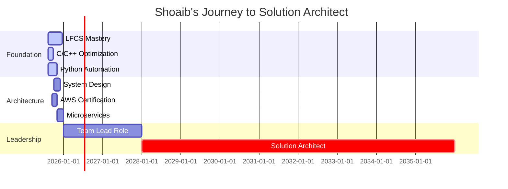

<div align="center">

# 🏥⚡ Mohammed SHOAIB U⚡🏥

## 🚀 **ELECTRONICS AND COMMUNICATION ENGINEER** → **HEALTHCARE TECH INNOVATOR** → **FUTURE SOLUTION ARCHITECT**


---

### 🎯 **MISSION STATEMENT**
> *"Architecting scalable, high-performance healthcare systems that save lives through optimized code, robust databases, and intelligent system design"*

</div>

---

## 🌟 **THE SHOAIB DIFFERENCE**

<table>
<tr>
<td width="50%">

### 🔥 **UNIQUE VALUE PROPOSITION**
```javascript
const MohammedShoaib = {
    superpower: "Hardware + Software + Healthcare Domain",
    rareSkills: [
        "C/C++ Performance Optimization",
        "Oracle Database Architecture", 
        "Healthcare Compliance (HIPAA)",
        "Linux System Internals",
        "Electronics + Software Integration"
    ],
    impact: "10,000+ patient records processed daily",
    efficiency: "40% performance improvement in production",
    vision: "Solution Architect by 2035"
}
```

</td>
<td width="50%">

### 🏆 **CAREER ACHIEVEMENTS**
- 🎓 **B.E in Electronics & Communication**
- 💼 **4+ Years Software Development** 
- 🏥 **Healthcare Tech Specialist** (2025+)
- ⚡ **Performance Optimization Expert**
- 🐧 **Linux System Administrator**
- 🗄️ **Database Architecture Specialist**
- 📈 **40% Performance Improvement** in production systems

</td>
</tr>
</table>

---

## 🛠️ **TECHNOLOGY MASTERY MATRIX**

<div align="center">

### **🔥 CORE EXPERTISE**


### **🚀 RAPID GROWTH TECHNOLOGIES**


</div>

### 📊 **SKILL PROGRESSION DASHBOARD**

```ascii
Programming Languages Mastery:
C/C++          ████████████████████ 95% ⚡ Production Expert
Python         ██████████████░░░░░░ 70% 🚀 Rapidly Growing  
Oracle PL/SQL  ████████████████████ 90% 🗄️ Database Architect
Shell Script   ████████████████░░░░ 80% 🐧 System Automation
Java           ██████░░░░░░░░░░░░░░ 30% 📈 2025 Target

System Architecture Skills:
Performance Tuning    ████████████████████ 95%
Database Optimization ████████████████████ 90%
System Design        ██████████████░░░░░░ 70%
Cloud Architecture   ██████████░░░░░░░░░░ 50%
Microservices        ████████░░░░░░░░░░░░ 40%
```

---

## 🏗️ **FLAGSHIP PROJECTS & INNOVATIONS**

<table>
<tr>
<td width="33%">

### 🏥 **HealthCore Engine**
**🎯 Impact**: 10,000+ patient records/day  
**⚡ Tech**: C, Oracle, Unix  
**🚀 Achievement**: 40% performance boost  
**🔒 Compliance**: HIPAA compliant  

```c
// Performance-critical patient data processing
typedef struct {
    patient_id_t id;
    medical_data_t* records;
    timestamp_t last_updated;
} PatientRecord;
```

</td>
<td width="33%">

### 📊 **Real-Time DB Monitor**
**🎯 Purpose**: Live healthcare DB monitoring  
**⚡ Tech**: Python, Oracle, Shell  
**🚀 Feature**: Predictive failure detection  
**📈 Result**: 99.9% system uptime  

```python
# Intelligent database health monitoring
class HealthcareDBMonitor:
    def predict_performance_issues(self):
        return self.ml_model.predict(
            self.collect_metrics()
        )
```

</td>
<td width="33%">

### ⚡ **SystemOps Automation**
**🎯 Goal**: Zero-touch deployments  
**⚡ Tech**: Shell, Python, Linux  
**🚀 Impact**: 60% reduction in manual ops  
**🏆 Quality**: Zero-downtime deployments  

```bash
#!/bin/bash
# Automated healthcare system deployment
deploy_healthcare_stack() {
    validate_compliance
    zero_downtime_deploy
    run_health_checks
}
```

</td>
</tr>
</table>

---

## 📈 **PERFORMANCE METRICS & GITHUB ANALYTICS**

<div align="center">


</div>

---

## 🎯 **2025 TRANSFORMATION ROADMAP**

<div align="center">



</div>

### 🏆 **CERTIFICATION BATTLE PLAN**

| 🎯 Certification | 📅 Target Date | 💪 Status | 🔥 Priority |
|---|---|---|---|
| 🐧 **LFCS (Linux Foundation)** | Dec 21, 2025 | 🟡 In Progress | 🔴 CRITICAL |
| ☁️ **AWS Solutions Architect** | Oct 2025 | 🟢 Planned | 🟠 HIGH |
| 🗄️ **Oracle Database Expert** | Nov 2025 | 🟢 Planned | 🟠 HIGH |
| 🏗️ **TOGAF Enterprise Architect** | 2026 | 🔵 Future | 🟢 MEDIUM |

---

## 🧠 **LEARNING PHILOSOPHY & DAILY COMMITMENT**

<table>
<tr>
<td width="50%">

### 💡 **THE SHOAIB METHOD**
```python
class ContinuousLearning:
    def __init__(self):
        self.daily_commitment = "3+ hours"
        self.documentation = "Everything"
        self.sharing = "Viva Engage Daily"
        self.projects = "Real-world focused"
    
    def grow(self):
        return self.learn() + self.build() + self.share()
```

</td>
<td width="50%">

### 🎯 **2025 MONTHLY MISSIONS**
- **🔥 AUG**: C Mastery + LFCS + Python Foundation
- **⚡ SEP**: C++ Advanced + Python Automation + AWS
- **🚀 OCT**: System Design + Go Lang + Cloud Architect
- **💪 NOV**: Multi-Cloud + Microservices + Leadership
- **🏆 DEC**: Portfolio + LFCS Exam + Mock Interviews

</td>
</tr>
</table>

---

## 🌐 **DIGITAL PRESENCE & THOUGHT LEADERSHIP**

<div align="center">

### 📚 **DAILY KNOWLEDGE SHARING**
*Building in public, teaching while learning*

### 🎤 **CONTENT CALENDAR**
- 📖 **Monday**: *C Programming Mastery*
- 🐧 **Tuesday**: *Linux System Administration* 
- 🐍 **Wednesday**: *Python Automation Wizardry*
- 🏗️ **Thursday**: *System Architecture Deep-Dives*
- 🚀 **Friday**: *Project Showcase & Wins*

</div>

---

## ⚡ **CURRENT STATUS & AVAILABILITY**

<div align="center">

```bash
$ whoami
shoaib@healthcare-systems:~$ Solution Architect in Training

$ pwd  
/career/path/application-developer/transitioning-to/solution-architect

$ cat current_mission.txt
🎯 MISSION: Transform healthcare through optimized, scalable system architecture
🔥 STATUS: Actively mastering Python + System Design + Cloud Architecture  
⚡ ENERGY: 100% committed to excellence and continuous growth
🚀 ETA: Solution Architect certification by 2035

$ uptime
 System uptime: 4 years, 8 months (since career start)
 Learning streak: 365+ days of continuous improvement
 Passion level: Maximum overdrive 🔥

$ ps aux | grep interests
├── Healthcare Technology Innovation
├── Performance Optimization & System Tuning  
├── Database Architecture & Scaling
├── Linux System Administration & Automation
├── Mentoring Junior Developers
└── Open Source Healthcare Solutions
```

</div>

---

## 🤝 **COLLABORATION & PARTNERSHIP OPPORTUNITIES**

<table>
<tr>
<td width="50%">

### 🎯 **I'M LOOKING FOR**
- 🏥 **Healthcare Tech Projects**
- ⚡ **Performance Optimization Challenges**  
- 🏗️ **System Architecture Discussions**
- 👥 **Mentorship & Knowledge Exchange**
- 🌟 **Open Source Contributions**

</td>
<td width="50%">

### 💪 **I CAN HELP WITH**
- 🔧 **C/C++ Performance Optimization**
- 🗄️ **Oracle Database Tuning**
- 🐧 **Linux System Administration** 
- 🏥 **Healthcare Domain Insights**
- 📚 **Technical Documentation & Training**

</td>
</tr>
</table>

<div align="center">

### 📬 **LET'S BUILD SOMETHING AMAZING TOGETHER**

[](mailto:md.shoaibumer@gmail.com)

</div>

---

## 🏁 **THE JOURNEY CONTINUES...**

<div align="center">

```
    🏥 HEALTHCARE TECHNOLOGY ARCHITECT 🏥
    ════════════════════════════════════════
    
    [████████████████████████░░░░░░] 80% to Solution Architect
    
    🎯 Next Milestone: Senior Developer (2027)
    🚀 Ultimate Goal: Principal Solution Architect (2035)
    
    💡 "Every line of code I write brings healing to someone, somewhere"
    ⚡ "Performance isn't just optimization—it's patient care"
    🏗️ "Architecture isn't just structure—it's the foundation of trust"
```

### 🌟 **IMPACT STATEMENT**
> *"In the intersection of Electronics, Software, and Healthcare lies the future of patient care. I'm architecting that future, one optimized system at a time."*

---

**⭐ Found my profile interesting? Star my repositories!**  
**🔀 Want to collaborate? Fork my projects and let's build together!**  
**📧 Have a challenging problem? Let's solve it as a team!**


</div>
